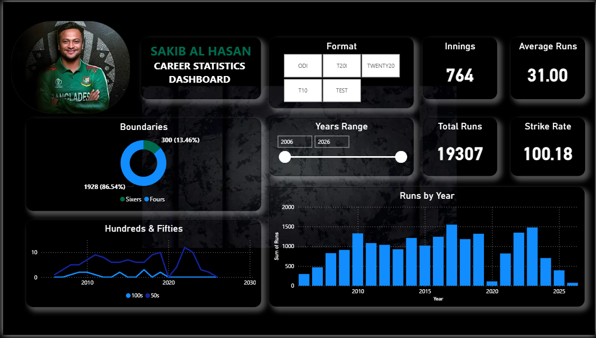

# 🏏 Shakib Al Hasan — Career Statistics Dashboard | Power BI



## 📌 Project Overview

This project presents an interactive **Cricket Career Statistics Dashboard** built in **Power BI**, analyzing the complete international career of **Shakib Al Hasan** — Bangladesh's greatest all-rounder and one of the top-ranked cricketers in the world. The dashboard covers career data from **2006 to 2026** across all major formats, enabling dynamic exploration of batting performance, boundary statistics, and year-on-year trends.

---

## 🎯 Key Metrics

| Metric | Value |
|---|---|
| Total Career Innings | 764 |
| Total Career Runs | 19,307 |
| Strike Rate | 100.18 |
| Average Runs | 31.00 |

---

## 📊 Dashboard Features

- **Format Filter**
  Interactive buttons to filter data by format: ODI, T20I, Twenty20, T10, and TEST — all visuals update dynamically

- **Year Range Slider**
  Dynamic year range selector (2006–2026) allowing exploration of performance across specific career periods

- **Boundaries Breakdown (Donut Chart)**
  Visual split between Fours (1928 | 86.54%) and Sixes (300 | 13.46%) across the career

- **Hundreds & Fifties Trend (Line Chart)**
  Time-series chart tracking the frequency of centuries and half-centuries throughout the career

- **Runs by Year (Bar Chart)**
  Year-on-year total runs bar chart showing peak performance years, career decline patterns, and consistency over time

- **KPI Cards**
  Dynamic top-level cards for Innings, Average Runs, Total Runs, and Strike Rate — all responsive to active filters

---

## 🛠️ Tools & Technologies

- **Power BI Desktop** — Dashboard design and interactive visualization
- **Microsoft Excel** — Data cleaning and preprocessing
- **DAX (Data Analysis Expressions)** — Custom measures, KPI cards, dynamic calculations
- **Power Query** — Data transformation and modeling


---

## 💡 Key Insights

1. **T20I and ODI formats** account for the majority of career runs — reflecting Shakib's dominance in limited-overs cricket
2. **Peak performance years** were between 2012–2021, with consistently high run totals and frequent fifties
3. **Strike rate of 100.18** reflects aggressive batting, particularly in T20 formats
4. **Boundary analysis** shows Fours dominate (86.54%) — indicating a ground-based, placement-focused batting style
5. **December 2023 onwards** shows reduced innings and output — consistent with age and workload management

---

## 📁 Repository Structure

```
shakib-al-hasan-career-statistics-dashboard/
│
├── shakib-al-hasan-career-statistics-dashboard.pbix     # Power BI dashboard file                             
├── preview.png                                          # Dashboard screenshot
└── README.md                                            # Project documentation
```

---

## 🚀 How to Use

1. Download the `.pbix` file
2. Open it in **Power BI Desktop** (free download from microsoft.com)
3. Use the **Format buttons** to filter by match format
4. Drag the **Year Range slider** to explore specific career periods
5. All KPI cards and charts update dynamically based on your selections

---

## 👤 Author

**Md Murtoza Mahir**
Data Analyst | Power BI | SQL | Python | Excel
📧 murtozamahir.info@gmail.com
🔗 [LinkedIn](https://www.linkedin.com/in/murtoza-mahir)
🐙 [GitHub](https://github.com/murtoza-mahir)

---

> *This project was built for analytical and portfolio purposes to demonstrate interactive sports data visualization and career trend analysis using Power BI.*
